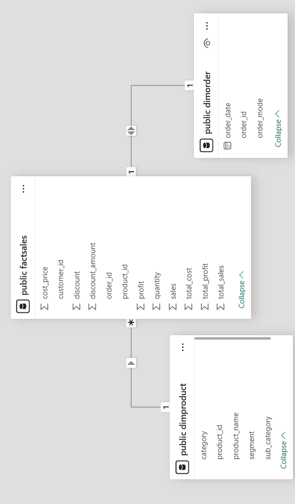
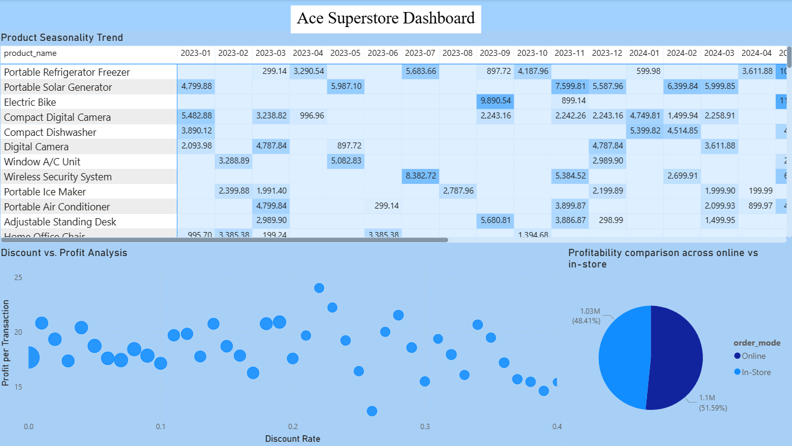

# Ace Superstore Dimensional Modelling Using PowerBI
## Project Title: Dimensional Modeling, SQL Transformation & Power BI Reporting

## Introduction

This repository contains the complete implementation of Task 2 for the RDAMP program, which focuses on transforming cleaned retail data into a query-optimized star schema and visualizing business insights using Power BI. The project revolves around Ace Superstore's sales dataset and aims to deliver a scalable, structured, and interactive reporting system to facilitate strategic decision-making.

The work includes SQL-based data modeling using PostgreSQL, the creation of reusable views for analytical insights, and the development of a Power BI dashboard that presents KPIs such as product trends, profitability analysis, customer segmentation, and discount impact.

---
## Dimensional Schema Overview

To support efficient and flexible reporting, a star schema was designed with a single fact table and multiple dimension tables. The fact table, `FactSales`, captures all transactional data, while dimension tables provide descriptive context about products and orders.

The schema enables multidimensional analysis of sales, costs, discounts, and profitability by linking structured product and order attributes to the sales data. The primary keys of the dimension tables serve as foreign keys in the fact table, allowing joins across views and queries.

### Schema Diagram

Below is the schema diagram that visually represents the star schema design:

---
## Tables and Purpose

### Fact Table: FactSales

The `FactSales` table forms the core of our data model. It contains transactional data, such as sales, quantity, cost, profit, discounts, and associated amounts. It references the primary keys of the order and product dimensions to establish relationships. This table enables the calculation of key metrics like total revenue, total cost, and profit margin.

### Dimension Table: DimProduct

The `DimProduct` table provides detailed information about each product sold by Ace Superstore. Attributes include `Product_ID`, `Product_Name`, `Category`, `Sub_Category`, and `Segment`. This table supports segmentation and performance tracking by product type and hierarchy.

### Dimension Table: DimOrder

The `DimOrder` table captures metadata about each order. It includes the `Order_ID`, `Order_Date`, and `Order_Mode`, enabling time-series analysis and performance evaluation across sales channels (e.g., In-Store vs. Online).

---

## SQL Setup Instructions

To reproduce the schema and data in a PostgreSQL environment, follow the steps below:

1. **Create the schema structure** by executing the SQL file `Aqsa_Shabbir_create_tables.sql`, which contains the `CREATE TABLE` statements for `DimProduct`, `DimOrder`, and `FactSales`, along with all necessary foreign key constraints and data types.

2. **Populate the tables** using the `COPY` command by executing the SQL file `Aqsa_Shabbir_populate_dimensions.sql`. CSV files (`DimProduct.csv`, `DimOrder.csv`, and `FactSales.csv`) are used to bulk import the cleaned and structured data which are present in the Dataset Folder. These commands assume the files are stored locally and are accessible from the database environment.

3. **Create SQL views** for reusable business insights by executing the SQL file `Aqsa_Shabbir_create_views.sql`. The script defines three core views:
   - `vw_product_seasonality`: Tracks product performance trends over time.
   - `vw_discount_impact_analysis`: Analyzes how discounts affect profitability.
   - `vw_channel_margin_report`: Compares revenue and profit margins across sales channels.

4. **Run additional insight queries** defined in the 'Aqsa_Shabbir_queries.sql' file. These include reports for top-selling products, customer profit contributions, and order value analysis.

---

## SQL Views Created

Three SQL views were developed and directly utilized within Power BI:

- **vw_product_seasonality**: Aggregates monthly sales data per product, helping identify seasonal demand fluctuations.
- **vw_discount_impact_analysis**: Groups sales by discount rate, showing how different discount levels influence transaction count, total revenue, and average profit.
- **vw_channel_margin_report**: Compares total revenue and profit by order mode (In-Store vs. Online), offering insights into sales channel efficiency.

Each of these views is written to be performant and easily extendable for future reporting needs.

---

## Power BI Connection Steps

To visualize the insights from the SQL views, Power BI Desktop was used. The steps followed to establish the connection are as follows:

1. Open Power BI Desktop and choose **Get Data** → **PostgreSQL**.
2. Enter your PostgreSQL server address and database name.
3. Select the view from the list of tables.
4. Load the views into the Power BI model.
5. Use Power BI’s drag-and-drop interface to design visualizations for each insight.

This connection enables dynamic reporting that updates automatically as the underlying database is refreshed.

---

## Power BI Dashboard Overview

The dashboard was designed to present key performance indicators (KPIs) from multiple dimensions, enabling managers to make informed decisions based on real-time data. It includes visualizations that represent trends, relationships, and comparisons across product categories, sales channels, discounts, and customer behavior.

### Dashboard Screenshot

Below is the screenshot of the completed Power BI dashboard:

### Dashboard Views and Insights

- **Product Seasonality Trend (Matrix)**: This view highlights the best-performing months for each product, making it easier to align inventory and promotions with seasonal demand.
- **Discount vs. Profit Analysis (Scatter Plot)**: This visualization reveals how increased discounts tend to correlate with lower average profits, assisting in pricing strategy decisions.
- **Profitability by Channel (Pie Chart)**: A clear breakdown of profit contribution between online and in-store sales. In this case, in-store orders contribute slightly more to total profits than online ones.
---

## Reusable SQL Queries

In addition to the views, five reusable queries were written to support strategic reporting:

1. **Total Sales and Profit by Product Category**  
2. **Top 10 Best-Selling Products by Quantity**  
3. **Average Order Value by Channel**  
4. **Customer Profit Contribution (Top 10 Customers)**  
5. **Category Performance Over Time**

These queries join dimension and fact tables and can be reused across dashboards or exported for CSV-based reporting.

---
## Conclusion and Recommendations

Based on the interactive Power BI dashboard developed from the SQL views and dimensional model, several key insights have emerged that can directly inform business strategy for Ace Superstore.

Firstly, the **Product Seasonality Trend** matrix reveals that certain products such as the *Electric Bike*, *Compact Digital Camera*, and *Portable Solar Generator* show strong seasonal sales spikes. For instance, Electric Bike sales peaked significantly in July 2023 and again in April 2024, suggesting that these products align with summer or travel-related demand. Ace Superstore should consider increasing inventory and marketing spend on these items during their peak months to maximize revenue.

Secondly, the **Discount vs. Profit Analysis** scatter plot highlights a clear inverse relationship between discount rate and average profit per transaction. Transactions with higher discounts tend to yield lower profits. This indicates that while discounts may help in increasing sales volume, they often erode profitability. The business should adopt a more strategic discounting approach—possibly using targeted or limited-time offers—instead of broad-based discounting to protect profit margins.

Thirdly, the **Channel Profitability Report** using a pie chart reveals that *in-store sales* slightly outperform *online sales* in terms of total profit contribution (51.59% vs 48.41%). While both channels are nearly balanced, this insight suggests that Ace Superstore’s physical stores remain a crucial profit center. The company should continue investing in in-store experiences and promotions while also enhancing the online shopping platform to close the gap further.

Additional queries (not shown in the dashboard but available in the SQL script) also highlight that a small group of high-value customers contributes disproportionately to total profit. These **top 10 customers by profit** should be prioritized for loyalty programs and personalized engagement to retain and expand their lifetime value.

Lastly, **category performance over time** revealed that some product categories consistently outperform others across months. Monitoring and reallocating marketing or procurement budgets toward consistently high-performing categories could yield better returns.

In summary, Ace Superstore can drive better business outcomes by optimizing inventory around seasonal demand patterns, applying smarter discounting strategies, strengthening in-store engagement, and nurturing high-value customers. These recommendations, grounded in the insights derived from the dimensional model and Power BI dashboard, align with the goal of data-driven decision-making across retail operations.

